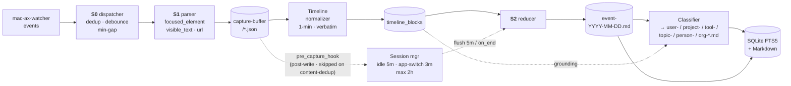

<p align="center">
  
</p>

<h1 align="center">OpenChronicle</h1>

<p align="center">
  Open-source, local-first memory for any tool-capable LLM agent.
</p>

<p align="center">
  Think OpenAI Chronicle - but open, model-agnostic, inspectable, and hackable.
</p>

---

> **Status:** v0.1.0 · macOS only · early alpha

OpenChronicle gives AI agents a local, inspectable memory built from real screen and app context.

It runs on your Mac, captures structured context from what you're doing, and turns it into persistent Markdown memory: what you're working on, what you've decided, which tools you use, and which people or projects matter.

Any agent that can call tools can use it. MCP clients work especially well today, but OpenChronicle is meant to be a general memory layer for tool-using agents - not something tied to one protocol, one model provider, or one app.

---

## Why OpenChronicle

OpenAI Chronicle points to an important future: agents that remember your real working context.

OpenChronicle is our open alternative:

- **Local-first** - memory stays on your machine
- **Model-agnostic** - use Ollama, LM Studio, OpenAI, Anthropic, or any LiteLLM-compatible provider
- **Tool-friendly** - usable by any tool-capable agent
- **Inspectable** - Markdown on disk, SQLite locally
- **Open** - MIT-licensed and built to be extended

---

## Why AX-first

OpenChronicle currently prioritizes **AX Tree / accessibility-tree context** as its primary signal, with screenshots as a secondary signal over time.

We think this is the right tradeoff for an early memory system:

- **Lower cost** - structured text is far cheaper to process than screenshot-heavy OCR / vision pipelines
- **Better intent capture** - AX is often better for active app, focused element, edited text, URL, and interaction state
- **Smaller, cleaner memory** - easier to deduplicate, normalize, index, and retain long-term
- **Better foundation** - screenshots can later enrich visual context where AX falls short

> **AX-first for accurate, compact, low-cost memory; screenshot-assisted for richer multimodal context.**

---

## OpenChronicle vs OpenAI Chronicle

|                     | OpenAI Chronicle                | **OpenChronicle**                              |
| ------------------- | ------------------------------- | ---------------------------------------------- |
| Source              | Closed                          | **MIT, open-source**                           |
| Model choice        | OpenAI-centric                  | **Your choice**                                |
| Who can use it      | Product-specific workflow       | **Any tool-capable agent**                     |
| Primary capture     | Screenshot / OCR-heavy          | **AX Tree first**, screenshot-assisted         |
| Storage             | Local generated memories        | **Markdown + SQLite on your machine**          |
| Extensibility       | Limited                         | **Hackable parsers, memory logic, integrations** |

---

## How it works



The core idea is simple:

1. capture context
2. compress it into sessions
3. extract durable facts
4. store memory locally
5. let agents query it through tools

---

## What you get

* **Event-driven capture** from macOS AX events
* **Session-aware memory writing** instead of noisy per-snapshot logs
* **Human-readable Markdown memory**
* **Local SQLite indexing**
* **Structured memory files** like user-, project-, tool-, topic-, person-, org-, and daily event-
* **Supersede-not-delete history**
* **Local or cloud model support**
* **Always-on agent-readable interface**, with MCP as the best-supported path today

---

## Install

Requires **macOS 13+**, **Python 3.11+**, and **Xcode Command Line Tools** (xcode-select --install).

```bash
git clone https://github.com/openchronicle/openchronicle.git
cd openchronicle
uv tool install .
bash resources/build-mac-ax-helper.sh
bash resources/build-mac-ax-watcher.sh
openchronicle status
```

If `openchronicle: command not found`, run:

```bash
uv tool update-shell
```

Then open a new terminal.

Grant Accessibility permission the first time you run it:

**System Settings → Privacy & Security → Accessibility → add your terminal**

---

## Run

```bash
openchronicle start
openchronicle start --foreground
openchronicle status
openchronicle pause
openchronicle resume
openchronicle stop
```

Useful inspection commands:

```bash
openchronicle capture-once
openchronicle timeline tick
openchronicle timeline list
openchronicle writer run
openchronicle rebuild-index
```

---

## Connect an agent

OpenChronicle is designed for **tool-calling agents**.

### Best-supported path today: MCP

The daemon hosts an MCP endpoint at:

```bash
http://127.0.0.1:8742/mcp
```

Supported integration paths include:

* Claude Code
* Claude Desktop
* Codex
* opencode
* custom local agents
* and more...

See [docs/mcp.md](docs/mcp.md) for setup details.

---

## Contributing

We especially want help in three areas:

### 1. Better context parsers

App-specific parsing and normalization for browsers, terminals, editors, Slack, Notion, Cursor, Linear, Figma, and more.

### 2. Better memory management

Session reduction, durable-fact extraction, compaction, supersede / merge logic, and retrieval quality.

### 3. More agent integrations

Support for more MCP clients, IDE agents, coding assistants, desktop agents, and local orchestration frameworks.

If you care about local-first agents, personal AI memory, or open context infrastructure, this project is for you.

---

Documentation

* [docs/architecture.md](docs/architecture.md) - end-to-end pipeline and code layout
* [docs/config.md](docs/config.md) - configuration and model setup
* [docs/capture.md](docs/capture.md) - event-driven capture and AX details
* [docs/timeline.md](docs/timeline.md) - normalization and anti-hallucination design
* [docs/session.md](docs/session.md) - session cutting rules
* [docs/writer.md](docs/writer.md) - reducer, classifier, and retry model
* [docs/mcp.md](docs/mcp.md) - current tool surface and integrations
* [docs/memory-format.md](docs/memory-format.md) - file layout and supersede semantics
* [docs/troubleshooting.md](docs/troubleshooting.md) - common issues

---

## Development

```bash
uv sync --all-extras
uv run pytest
uv run ruff check
```

---

## License

MIT.