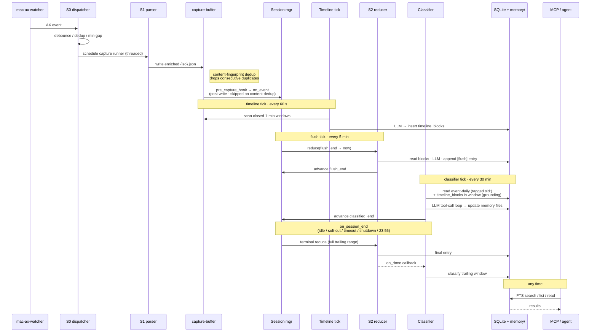

# Architecture

OpenChronicle is a single daemon that ingests capture events, compresses them through a deterministic funnel, and classifies the result into durable Markdown memory. There is only one ingestion path — no modes.

```mermaid
flowchart LR
    W[mac-ax-watcher<br/>Swift binary]

    subgraph capture [Capture Layer]
        direction TB
        S0["<b>S0</b> event_dispatcher<br/>dedup · debounce · min-gap"]
        S1["<b>S1</b> s1_parser<br/>focused_element · visible_text · url"]
        BUF[(capture-buffer/*.json)]
        S0 --> S1 --> BUF
    end

    subgraph compress [Compression Layer]
        direction TB
        TL["Timeline aggregator · LLM<br/>1-min normalized blocks<br/>verbatim-preserving"]
        BLOCKS[(timeline_blocks)]
        SM["Session manager<br/>3-rule cutter<br/>active → ended"]
        S2["<b>S2</b> session_reducer · LLM<br/>async thread"]
        TL --> BLOCKS
        BLOCKS -- read window --> S2
        SM -. trigger: flush 5m / on_session_end .-> S2
    end

    subgraph memory [Memory Layer]
        direction TB
        ED[(event-YYYY-MM-DD.md)]
        CLF["Classifier · LLM<br/>tool-call loop · 30 m tick + terminal"]
        MF[(user- · project- · tool- ·<br/>topic- · person- · org-*.md)]
        CMP["Compact · LLM<br/>on-demand"]
        ED --> CLF --> MF
        MF -. read / rewrite .-> CMP
        CMP -. supersede .-> MF
    end

    subgraph query [Query Layer]
        direction TB
        FTS[(SQLite FTS5<br/>entries_fts · captures_fts)]
        MCP["MCP server<br/>127.0.0.1:8742/mcp"]
        AG[Tool-capable agents<br/>Claude Code · Desktop · Cursor · Codex · …]
        FTS --> MCP --> AG
    end

    W --> S0
    BUF -. pre_capture_hook<br/>(post-write · skipped on content-dedup) .-> SM
    BUF --> TL
    S2 --> ED
    BLOCKS -. grounding .-> CLF
    MF --> FTS
    ED --> FTS
    BUF -. indexed .-> FTS
```



## Runtime sequence

A typical 5-minute flush window, showing how one AX event propagates through to durable memory:



## Tasks in the daemon

Defined in `src/openchronicle/daemon.py`.

| Task | Purpose |
|---|---|
| `capture` | Consumes `mac-ax-watcher` events, debounces, writes enriched JSON captures (incl. S1 fields) to `~/.openchronicle/capture-buffer/`. Heartbeat catches quiet periods. Also calls `SessionManager.on_event` on every capture so the session cutter sees the same signal. |
| `timeline` | Every 60s scans for closed wall-clock windows (default 1 min) and runs the `timeline` LLM stage to normalize each window while preserving authored text verbatim. Cleans buffer files older than the newest block. |
| `session` | Every `session.tick_seconds` (default 30), calls `SessionManager.check_cuts()` so idle-gap and timeout cuts fire even when the dispatcher is quiet. |
| `flush` | Every `session.flush_minutes` (default 5, clamped to 5-min floor), runs the reducer incrementally over the active session's newly closed timeline blocks (~5 of them at defaults) and appends `[flush]`-tagged partial entries to today's event-daily. |
| `classifier-tick` | Every `classifier.interval_minutes` (default 30, min 5), runs the classifier over any event-daily entries appended since the session's `classified_end` bookmark. Silent no-op when no new entries have landed. |
| `daily-safety-net` | Once per local day at `reducer.daily_tick_hour:minute` (default 23:55), force-ends the currently-open session and reduces every stranded `ended`/`failed` session row — the "we survived a crash or midnight rollover" safety net. |
| `mcp` | Hosts the Reader MCP server inside the daemon. Exponential backoff on crash. |

The session cutter itself doesn't have a dedicated task — it runs inline on every capture via the `pre_capture_hook` wired in `daemon.py`. Session-end callbacks spawn the reducer on a daemon thread, which then fires the terminal classifier via its success callback (covering any trailing window the 30-min tick didn't reach). Each session's progress on both stages is bookkept on its sessions row: `flush_end` for the reducer, `classified_end` for the classifier.

`--capture-only` disables the timeline aggregator and MCP server. Capture, session, and the daily-safety-net still run so session rows land on disk.

## The session boundary

Three rules (ported verbatim from Einsia-Partner), all enforced in `session/manager.py`:

1. **Hard cut.** No capture-worthy events for `session.gap_minutes` (default 5) → close the session at the last event's timestamp.
2. **Soft cut.** A single unrelated app is focused for `session.soft_cut_minutes` (default 3) unless ≥2 distinct apps were focused in the preceding 2 minutes (frequent-switching defuses the rule).
3. **Timeout.** A session older than `session.max_session_hours` (default 2) is force-cut regardless.

Force-end is also called on daemon shutdown and on the 23:55 safety net, so a session never outlives the process that opened it.

## On-disk state

```
~/.openchronicle/
├── config.toml               # single source of truth for runtime config
├── .pid                      # daemon PID; absence ⇒ stopped
├── .paused                   # sentinel — capture skips while present
├── index.db                  # SQLite WAL; entries / files / timeline_blocks / sessions
├── capture-buffer/           # S1-enriched {iso8601}.json captures
├── memory/
│   ├── index.md              # auto-generated overview
│   ├── event-YYYY-MM-DD.md   # one file per day, one entry per reduced session
│   ├── user-*.md             # identity, preferences (durable)
│   └── project-*.md / tool-*.md / topic-*.md / person-*.md / org-*.md
└── logs/
    ├── capture.log           # watcher events, dedup, writes
    ├── timeline.log          # window scan, block production, buffer cleanup
    ├── session.log           # cut decisions, session-end events
    ├── writer.log            # reducer + classifier runs, tool calls
    ├── compact.log           # compact rounds with preservation ratios
    └── daemon.log            # lifecycle + MCP server
```

SQLite is opened with WAL mode — the MCP reader and the writer paths coexist without blocking.

## Code layout

```
src/openchronicle/
├── cli.py                    # Typer entry point
├── daemon.py                 # Async task orchestration
├── config.py                 # TOML loader, per-stage ModelConfig inheritance
├── paths.py                  # ~/.openchronicle/* paths
├── logger.py                 # Rotating file sinks per component
├── capture/
│   ├── watcher.py            # Spawns mac-ax-watcher, parses JSONL
│   ├── event_dispatcher.py   # Debounce / dedup / min-gap
│   ├── ax_capture.py         # One-shot mac-ax-helper invocation
│   ├── ax_models.py          # ax_tree_to_markdown, prune helpers
│   ├── s1_parser.py          # Enriches captures with focused_element / visible_text / url
│   ├── screenshot.py         # mss + PIL → base64 JPEG
│   ├── window_meta.py        # foreground app / title / bundle_id
│   └── scheduler.py          # Capture loop + buffer cleanup
├── timeline/
│   ├── store.py              # timeline_blocks schema + CRUD
│   ├── aggregator.py         # Captures-in-window → LLM → entries list
│   └── tick.py               # Every-minute scan for closed windows
├── session/
│   ├── store.py              # sessions table + retry bookkeeping
│   ├── manager.py            # 3-rule session cutter
│   └── tick.py               # Daemon wiring: check_cuts loop + daily safety net
├── writer/
│   ├── agent.py              # CLI entry: catch up pending sessions + classify
│   ├── session_reducer.py    # S2: session → event-YYYY-MM-DD.md entry
│   ├── classifier.py         # Extracts durable facts via the tool-call loop
│   ├── tools.py              # read/search/append/create/supersede/commit
│   ├── compact.py            # Per-file compaction with fact-preservation check
│   └── llm.py                # litellm wrapper; per-stage config
├── store/
│   ├── fts.py                # SQLite FTS5 schema, search, cursor context manager
│   ├── files.py              # Markdown + YAML frontmatter IO
│   ├── entries.py            # Entry format, supersede logic, rebuild_index
│   └── index_md.py           # Rebuild memory/index.md from the files table
├── mcp/
│   ├── server.py             # FastMCP server + tool definitions
│   └── captures.py           # Read-side helpers for raw capture buffer + captures_fts
└── prompts/
    ├── timeline_block.md     # short-window normalizer (verbatim-preserving)
    ├── session_reduce.md     # S2 reducer
    ├── classifier.md         # Durable-fact extraction
    ├── compact.md            # Compaction
    └── schema.md             # Full memory spec — also returned by MCP get_schema
```

## Why this shape

- **Compression first, classification second.** S1 → Timeline → S2 is a deterministic funnel with bounded prompt size at each step. By the time the classifier runs it sees a session-level summary, not raw AX snapshots — so there is no "is this worth writing?" triage call; the classifier just extracts any durable facts it finds, or skips.
- **Session as the natural unit.** A "session" — a bounded chunk of focused work — is what humans remember. Cutting on idle / app-switch / timeout produces event-daily entries with accurate time ranges, which solves the v1 problem of long sessions being under-reported after the first append.
- **Periodic classifier, bookmarked.** The classifier fires on a 30-min interval during each active session, then one last trailing-window pass at session end. Each pass advances the session's `classified_end` bookmark, so entries are never double-classified and long sessions produce durable facts without waiting to close.
- **Daily event files.** `event-YYYY-MM-DD.md` sorts alphabetically by day. Weekly files from v1 are left untouched — they stay searchable via FTS.
- **One process, many tasks.** Avoids IPC overhead and keeps `index.db` single-writer in practice. SQLite WAL gives the MCP reader what it needs.
- **MCP inside the daemon.** External MCP clients get a stable localhost URL instead of spawning a fresh stdio subprocess per session.
