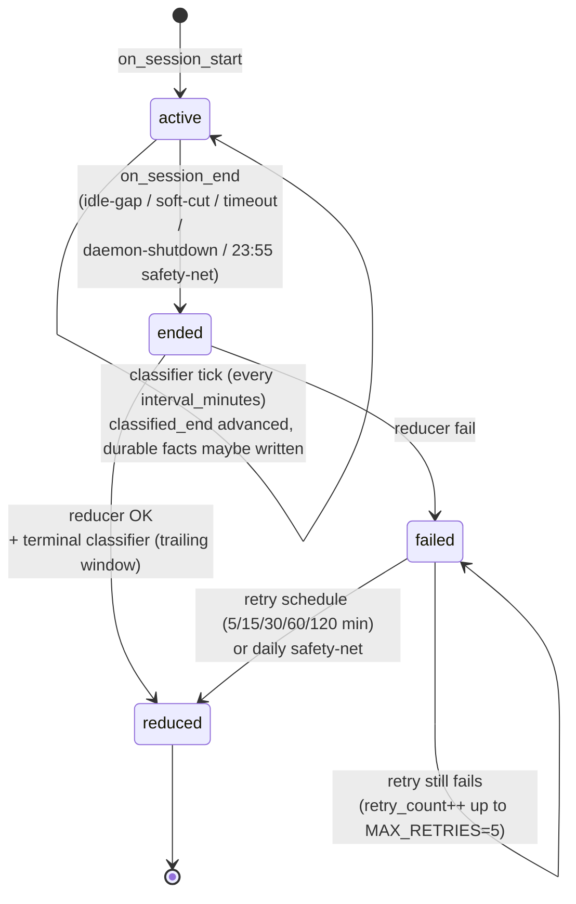

# Session

A "session" is a bounded chunk of focused work. OpenChronicle's writer pipeline is driven by session boundaries — the reducer writes incremental *flush* entries every 5 min while the session is active, the classifier fires every 30 min over whatever entries landed since its last pass, and when the session closes a final reducer pass + terminal classifier catch-up cover any trailing window. Each stage advances its own bookmark on the sessions row (`flush_end`, `classified_end`) so entries are never double-processed.

## Three cut rules

Implemented in `session/manager.py`, enforced in `check_cuts()` and on every `on_event()`. All times are local.

### 1. Hard cut (idle gap)

If no capture-worthy event has arrived for `session.gap_minutes` (default **5**), the session ends at the last event's timestamp.

> Rationale: lunch / phone call / real break. The gap itself isn't work, so the session ends *where* work paused, not *when* you came back.

### 2. Soft cut (single unrelated app)

If one unrelated app has held focus for `session.soft_cut_minutes` (default **3**) *and* frequent-switching is **not** active, the session ends.

> "Frequent-switching" = ≥2 distinct apps were focused in the last 2 minutes. Prevents the soft cut from firing during fast multi-app work (e.g. IDE + terminal + browser reference).

### 3. Timeout

A session older than `session.max_session_hours` (default **2**) is force-cut regardless of activity. Safety net against runaway sessions.

## Session state machine



Rows live in the `sessions` table (see [writer.md](writer.md#sessions-table)). `flush_end` tracks the last reduced window boundary so the next flush (or the terminal reduce) only covers *new* timeline blocks; `classified_end` plays the same role for the classifier.

## Flush tick (incremental reduce)

While a session is still `active`, a daemon task wakes every `session.flush_minutes` (default **5**, clamped to a 5-min floor to keep LLM cost bounded) and:

1. Snapshots the active `(session_id, session_start)` atomically.
2. Queries closed timeline blocks in `[flush_end or session_start, now)`.
3. If any new blocks exist, runs the reducer with `is_final=False` and appends a `[flush]`-tagged entry to today's `event-YYYY-MM-DD.md`.
4. Advances `flush_end` to the newest block boundary.

The classifier does **not** fire per flush — it runs on its own separate cadence (every `classifier.interval_minutes`, default 30; see [writer.md](writer.md#stage-2--classifier)) and again at the terminal reduce for the trailing window. Flush failures are logged but not retried — the next tick covers a bigger window, and the terminal reduce is the authoritative one.

Why 5-min minimum: the timeline stage is a verbatim-preserving normalizer, not a summarizer, so its blocks are narrow (default 1 min). A sub-5-min flush would mean many LLM calls over tiny block batches; at 5 min the flush consumes ~5 timeline blocks per call.

## Wiring

`session/tick.py::build_manager` returns a `SessionManager` with two callbacks wired:

- **`on_session_start`** — persists an `active` row immediately. A crash mid-session leaves a recoverable trace.
- **`on_session_end`** — marks the row `ended`, then spawns `reduce_session_async`. On terminal-reduce success, the reducer's `on_done` callback fires the classifier over `[classified_end or session_start, now)` — the trailing window the 30-min tick didn't reach.

Four daemon tasks back this up:

- **`run_check_cuts`** — every `session.tick_seconds` (default 30s), calls `check_cuts()` so idle-gap and timeout cuts fire even when no events are arriving.
- **`run_flush_tick`** — every `session.flush_minutes` (default 5), runs the reducer over the active session's new blocks and advances `flush_end`.
- **`run_classifier_tick`** — every `classifier.interval_minutes` (default 30), classifies event-daily entries that landed since `classified_end` and advances it.
- **`run_daily_safety_net`** — at local `reducer.daily_tick_hour:minute` (default 23:55), force-ends the currently-open session and runs `reduce_all_pending` to catch anything stranded at `ended`/`failed`.

## CLI

```bash
openchronicle writer run        # catch up any pending sessions + classify
```

This is the same code path the safety-net cron uses. Safe to run any time — idempotent via the session status check inside the reducer.

## Tuning

Almost every session-boundary complaint is one of these:

| Symptom | Knob |
|---|---|
| Sessions cut too eagerly during real focused work across multiple apps | `session.soft_cut_minutes` up (3 → 5), or leave it — the frequent-switching exception already handles most of these. |
| Sessions cut too late after idle (event-daily entries span more than the actual work) | `session.gap_minutes` down (5 → 3). |
| A single deep-work session grew past 2h and got chopped in half | `session.max_session_hours` up (2 → 4). You rarely want to disable this. |
| `check_cuts` feels laggy | `session.tick_seconds` down (30 → 10). Cost is negligible — the check is just arithmetic. |

## Why not write per-capture?

V1 did. Two production failure modes pushed v2 to session-level:

1. **Long sessions under-reported.** Once the writer had appended an entry about app X, every subsequent capture of app X triaged to "already recorded" — a 28-minute session would land as a 3-minute "user played a few minutes" entry. The dedup layer saved on tokens but lost the tail.
2. **Event files conflated days.** The old weekly rollup accumulated a whole week of user-stated facts + activity. A "what did I do today?" query had to scan 7 days.

Session-level writes make long work correct by construction (the reducer sees every timeline block in the range and prints an explicit time range), and `event-YYYY-MM-DD.md` is a one-file-per-day boundary that trivially answers day-scope queries.
